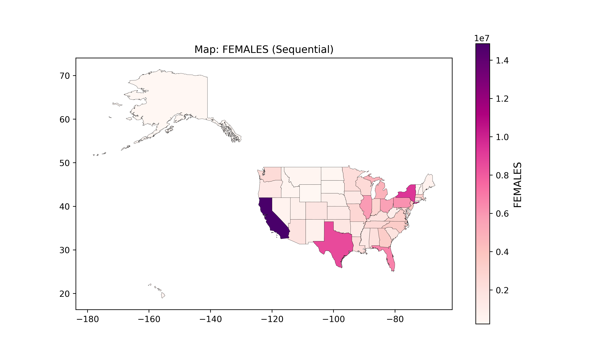
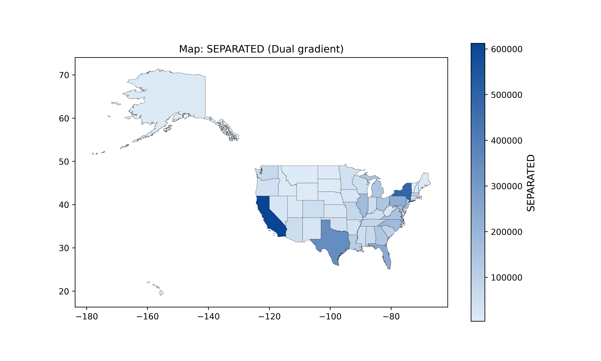
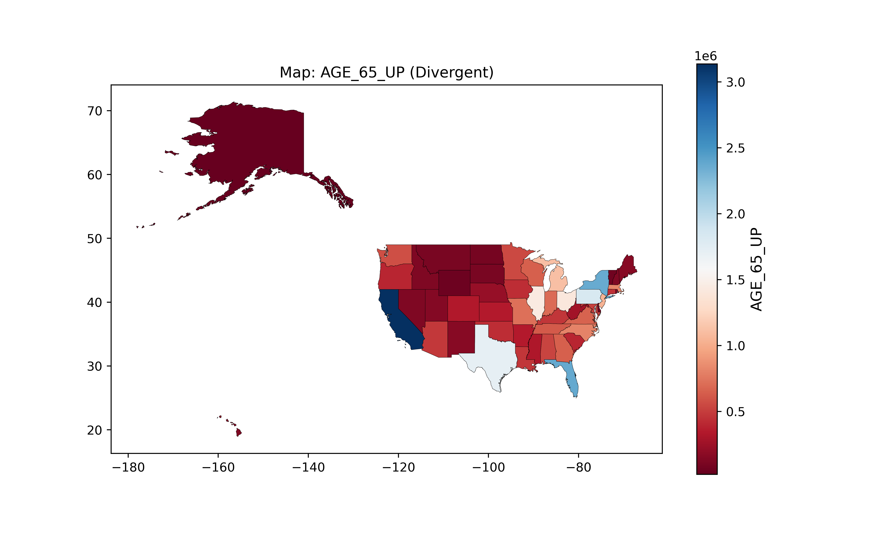

# **Adv. GIS Project**
## **GIS Color Schemes Plotting**

### **About This Project**
This project provides a user-friendly Python tool for visualizing geographic data with GeoPandas and Matplotlib. The tool allows users to:
- Select shapefiles from a directory.
- Choose specific attributes for visualization.
- Apply customizable color schemes tailored to the data's characteristics.

### **Why Correct Visualization Matters**
Maps are powerful tools for interpreting geographic data. Effective visualization ensures:
- **Clarity**: Patterns and trends become more evident.
- **Impact**: Insights are easier to communicate to diverse audiences.
- **Accuracy**: Misleading or confusing visualizations are avoided.

---

### **Importance of Color Schemes**
The choice of a color scheme can significantly alter how data is perceived:
1. **Sequential Schemes**: Best for numeric or ordered data (e.g., population density, elevation).
   - Example: Shades of green to represent increasing vegetation density.

2. **Diverging Schemes**: Ideal for data centered around a critical value (e.g., temperature anomalies).
   - Example: Blue for below-average, red for above-average.
     
3. **Qualitative Schemes**: Perfect for qualitative data (e.g., land use types).
   - Example: Assigning unique colors to urban, rural, and industrial zones.
     
  
     
     
This project emphasizes the importance of choosing meaningful color schemes to create accurate and compelling maps.

---

### **Features of the Tool**
- **Dynamic Shapefile Loading**: Easily upload and view shapefiles.
- **Attribute Selection**: Choose the column you wish to visualize.
- **Customizable Visualizations**: Adjust color schemes, map layouts, and more.
- **Interactive Maps**: Generate maps that are clear, intuitive, and ready to share.

---

### **Python Code Highlights**
Here are some important parts of the Python code behind this project:

#### **1. List Shapefiles in a Directory**
This function scans a directory and lists all available shapefiles, making it easier for users to select a file.
```python

def list_shapefiles(directory):
    all_files = os.listdir(directory)
    shapefiles = [file for file in all_files if file.endswith((".shp", ".SHP"))]
    return shapefiles
```

#### **2. Color scheme and color palette choice**
This part of the script allows the user to choose a color scheme and color palette and shows links to the ColorBrewer page for guidence.
```python
    # ColorBrewer links for guidance
    print("\nChoose a colormap type from the following options:")
    print("Sequential : for data that progresses (e.g., population density) _ https://colorbrewer2.org/#type=sequential&scheme=Blues&n=3")
    print("Divergent : for data with a central point (e.g., temperatures) _ https://colorbrewer2.org/#type=diverging&scheme=RdBu&n=3")
    print("Qualitative : for categorical data (e.g., land use types) _ https://colorbrewer2.org/#type=qualitative&scheme=Set1&n=3")
    print("Dual Gradient : for a custom gradient between two colors (e.g., red to yellow)")
    print("Interactive : for exploratory visualization\n")

    scheme_type = input("Choose a colormap type (sequential, divergent, qualitative, interactive, dual_gradient): ").lower()
    palette = None
    custom_colors = None

    if scheme_type == "dual_gradient":
        print("Dual Gradient: Provide two colors for the gradient.")
        start_color = input("Enter the start color (e.g., #d7191c): ")
        end_color = input("Enter the end color (e.g., #fdae61): ")
        custom_colors = [start_color, end_color]

    elif scheme_type in ["sequential", "divergent", "qualitative"]:
        palette = input(f"Choose a palette for {scheme_type} (or press Enter for default): ")
```

#### **3. Function to choose a color map**
This function chooses a colormap based on scheme type, palette, or custom color stops
```python
def choose_colormap(scheme_type, palette=None, custom_colors=None):
    if scheme_type == "dual_gradient":
        if not custom_colors or len(custom_colors) != 2:
            raise ValueError("Dual gradient requires exactly two colors (start and end).")
        return LinearSegmentedColormap.from_list("dual_gradient", custom_colors)
    if custom_colors:
        return LinearSegmentedColormap.from_list("custom", custom_colors)
    if scheme_type == "interactive":
        print("Available palettes from Colorcet:")
        print(cc.palette.keys())
        palette = input("Enter a palette name: ")
        return cc.palette.get(palette, "Blues")
    if scheme_type == "sequential":
        return palette if palette else "Blues"
    elif scheme_type == "divergent":
        return palette if palette else "RdBu"
    elif scheme_type == "qualitative":
        return palette if palette else "Set3"
    else:
        raise ValueError("Invalid scheme type. Choose 'sequential', 'divergent', 'qualitative', or 'dual_gradient'.")
```

#### **4. Function to plot**
This function creates a plot with the desired characteristics and allows to save the map
```python
def plot_geodataframe(gdf, column, scheme_type="sequential", palette=None, legend_bins=None, custom_colors=None, vmin=None, vmax=None):
    cmap = choose_colormap(scheme_type, palette, custom_colors)

    # Normalize the data for the colorbar
    norm = Normalize(vmin=vmin if vmin else gdf[column].min(), vmax=vmax if vmax else gdf[column].max())

    fig, ax = plt.subplots(figsize=(10, 6))

    # Plot the GeoDataFrame without the automatic legend
    gdf.plot(
        ax=ax,
        column=column,
        cmap=cmap,
        edgecolor="black",
        linewidth=0.2,
        legend=False,  # Suppress automatic legend
        norm=norm
    )
    ax.set_title(f"Map: {column} ({scheme_type.replace('_', ' ').capitalize()})", fontsize=12)

    # Create a ScalarMappable for the colorbar
    sm = ScalarMappable(norm=norm, cmap=cmap)
    sm.set_array([])  # Required for ScalarMappable
    cbar = fig.colorbar(sm, ax=ax, orientation="vertical")
    cbar.set_label(column, fontsize=12)

    # Save option
    save_option = input("Do you want to save the map? (yes/no): ").lower()
    if save_option == "yes":
        output_file = input("Enter the filename to save (e.g., map.png): ")
        fig.savefig(output_file, dpi=500)
        print(f"Map saved as {output_file}.")

    plt.show()
```

---
### **Repository Link**
Find the full source code and detailed documentation in the repository:

[**Adv. GIS Plotting Repository**](https://github.com/KarinaAnzar/GIS_Plotting.git)

---
### **Example Output Maps**
Sequential Map: U.S. Female population by State



Dual color Map: U.S. Separated population by State



Divergent Map: U.S. Population 65 years >


