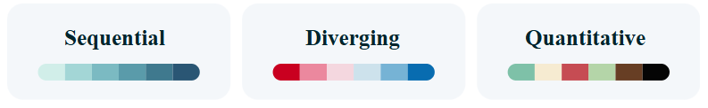

# **Adv. GIS Project**
## **GIS Color Schemes Plotting**

### **About This Project**
This project provides a user-friendly Python tool for visualizing geographic data with GeoPandas and Matplotlib. The tool allows users to:
- Select shapefiles from a directory.
- Choose specific attributes for visualization.
- Apply customizable color schemes tailored to the data's characteristics.

### **Why Correct Visualization Matters**
Maps are powerful tools for interpreting geographic data. Effective visualization ensures:
- **Clarity**: Patterns and trends become more evident.
- **Impact**: Insights are easier to communicate to diverse audiences.
- **Accuracy**: Misleading or confusing visualizations are avoided.

---

### **Importance of Color Schemes**
The choice of a color scheme can significantly alter how data is perceived:
1. **Sequential Schemes**: Best for numeric or ordered data (e.g., population density, elevation).
   - Example: Shades of green to represent increasing vegetation density.

2. **Diverging Schemes**: Ideal for data centered around a critical value (e.g., temperature anomalies).
   - Example: Blue for below-average, red for above-average.
     
3. **Qualitative Schemes**: Perfect for qualitative data (e.g., land use types).
   - Example: Assigning unique colors to urban, rural, and industrial zones.
     
  
     
     
This project emphasizes the importance of choosing meaningful color schemes to create accurate and compelling maps.

---

### **Features of the Tool**
- **Dynamic Shapefile Loading**: Easily upload and view shapefiles.
- **Attribute Selection**: Choose the column you wish to visualize.
- **Customizable Visualizations**: Adjust color schemes, map layouts, and more.
- **Interactive Maps**: Generate maps that are clear, intuitive, and ready to share.

---

### **Repository Link**
Find the full source code and detailed documentation in the repository:

[**Adv. GIS Plotting Repository**](https://github.com/KarinaAnzar/GIS_Plotting.git)

---
